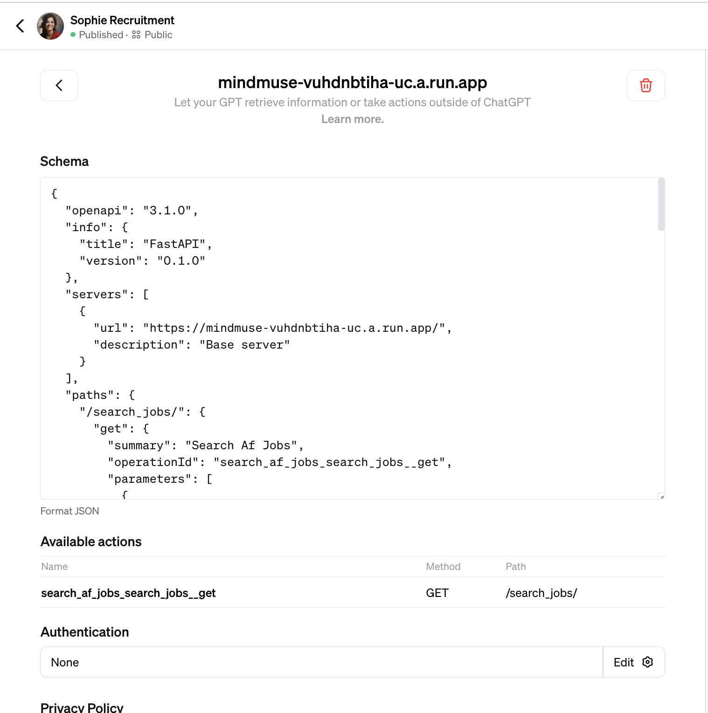

# API for Sophie Recruitment job search
https://mindmuse-vuhdnbtiha-uc.a.run.app/

This is the api for the Sophie Recruitment gpt
https://chat.openai.com/g/g-P7omjelKH-sophie-recruitment

The backend is a wrapper around the arbetsförmedlingen API and a similar setup can be used to create any backend for a gpt.

To get the open api specification, go to 
https://mindmuse-vuhdnbtiha-uc.a.run.app/openapi.json
this is automatically creates for a fast api server.

To add it to open ai you need to include the server url. 

openapi.yaml is a correct implementation.

You can ask gpt-4 to fill out your yaml from a json template :-)
<video src="chat_gpt_sophie_neko.webm">